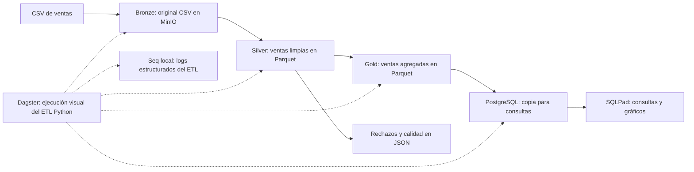

# Prueba de Data Lake: ventas con MinIO, Python, Dagster y SQLPad

Caso de uso: una tienda recibe un CSV de ventas y necesita conocer sus ingresos por día, ciudad y producto. El archivo tiene textos inconsistentes, un duplicado y filas inválidas. Esta prueba muestra cómo conservar el original, limpiar los datos y generar un resultado para consultar.

La implementación es pequeña: un CSV, un flujo Python y cinco servicios en Docker, incluido Seq local para los logs. Dagster permite ejecutar el ETL desde una interfaz visual y ver las dependencias, registros y resultados de cada etapa. El código Python contiene las transformaciones; la interfaz visual organiza su ejecución, sin ser un diseñador de transformaciones por arrastrar y soltar.

## Arquitectura



Bronze, silver y gold se almacenan en un mismo bucket de MinIO, en prefijos separados. SQLPad necesita un motor SQL: aquí consulta PostgreSQL, donde Python publica una copia de gold. PostgreSQL cumple el papel de consumo del diagrama de referencia.

| Capa | Qué hace | Ubicación |
| --- | --- | --- |
| Bronze | Guarda los bytes originales; el SHA-256 identifica el archivo | `s3://datalake/bronze/ventas/<sha256>.csv` |
| Silver | Valida fechas, cantidades y precios; normaliza textos; conserva la primera venta válida por ID | `s3://datalake/silver/ventas/ventas_limpias.parquet` |
| Calidad | Guarda filas rechazadas con su motivo y reconcilia los conteos | `s3://datalake/silver/ventas/rechazados.json` y `calidad.json` |
| Gold | Suma ventas, unidades e ingresos por fecha, ciudad y producto | `s3://datalake/gold/ventas/ventas_diarias.parquet` |
| Consumo | Publica gold para SQLPad | `gold.ventas_diarias` y `gold.calidad` en PostgreSQL |

Los importes se calculan con `Decimal` y se guardan como decimales de dos posiciones. La prueba usa una sola moneda: bolivianos (Bs).

## Estructura del proyecto

El ejemplo sigue la organización de [pyworkerlogsdemo](pyworkerlogsdemo/README.md), adaptada al ETL de ventas. El paquete instalable está bajo `src/` y cada carpeta tiene una responsabilidad:

```text
src/datalake_demo/
├── config/
│   ├── settings.py                   # Variables de entorno y .env
│   └── logging.py                    # Logs en consola, archivo y Seq
├── domain/
│   └── models.py                     # Datos extraídos y lote silver
├── etl/
│   ├── extract.py                    # Lectura de CSV y de las capas
│   ├── transform.py                  # Limpieza, validación y agregación
│   ├── load.py                       # Publicación de los resultados
│   └── pipelines/
│       └── ventas_pipeline.py        # Coordinación de las etapas
├── infra/
│   ├── file_storage.py               # Lectura de archivos y directorios
│   ├── minio_storage.py              # S3, JSON y Parquet
│   └── postgres_storage.py           # Conexiones y transacciones SQL
├── jobs/
│   ├── run_ventas_sync.py            # Ejecución por consola
│   ├── definitions.py                # Assets y job de Dagster
│   └── verify_ventas.py              # Verificación de integración
└── utils/
    └── time_utils.py                 # Marca de tiempo UTC
tests/
├── test_transforms.py                # Reglas de negocio
├── test_ventas_pipeline.py           # Flujo con adaptadores en memoria
└── test_seq_logging.py               # Envío CLEF y fallos de Seq
pyproject.toml                       # Paquete, dependencias y comandos
```

`SalesPipeline` recibe la configuración, los adaptadores de almacenamiento y el logger. Sus métodos coordinan extracción, transformación y carga; las conexiones S3/PostgreSQL pertenecen a `infra`. Los jobs de consola y Dagster llaman al mismo pipeline. Las pruebas pueden sustituir MinIO y PostgreSQL por adaptadores en memoria sin cambiar las reglas del negocio.

Como en la referencia, `config/settings.py` carga `.env` al iniciar el job y `config/logging.py` configura el logger. Las variables de entorno del proceso tienen prioridad sobre `.env`. Los logs de las etapas se guardan en `logs/ventas_etl.log`, con rotación, salen por consola y se envían al servidor Seq local.

## Ejecutar

Requisito: Docker Desktop iniciado en modo de contenedores Linux, con Docker Compose y acceso a Internet para descargar las dependencias. No necesitas instalar Python en Windows para ejecutar los contenedores.

Desde PowerShell, en esta carpeta:

```powershell
Copy-Item .env.example .env
docker compose up -d --build
docker compose ps
```

El primer arranque compila MinIO desde su código fuente e instala las dependencias Python; puede tardar varios minutos. Espera a que MinIO y PostgreSQL estén saludables y Dagster y SQLPad estén iniciados.

| Herramienta | Dirección | Acceso predeterminado |
| --- | --- | --- |
| Dagster | http://localhost:3000 | Sin autenticación, uso local |
| MinIO Console | http://localhost:9001 | `minio_demo` / `minio_demo_2026` |
| SQLPad | http://localhost:3001 | `demo@example.com` / `sqlpad_demo_2026` |
| Seq | http://localhost:5341 | Sin autenticación, demostración local |

Las credenciales son ficticias y configurables en `.env`. Los puertos publicados están limitados a `127.0.0.1`.

### Logs en Seq, como en pyworkerlogsdemo

`SeqHttpHandler` envía el mismo evento de logging por HTTP a `/api/events/raw`, en formato CLEF compatible con Serilog. En Python se usa `logging`; el servidor receptor es Seq. La integración usa la biblioteca estándar de Python para el envío HTTP.

Seq se ejecuta en el servicio `seq` de Docker y guarda sus eventos en el volumen `seq_data`. Dagster espera a que Seq esté saludable antes de iniciar. Dentro de Docker, el logger utiliza `SEQ_URL=http://seq:5341`; desde Windows, la interfaz y la API están en `http://localhost:5341`. Para esta prueba local se inicia sin autenticación. `SEQ_API_KEY` queda vacío y puede configurarse si habilitas una API key en Seq.

1. Ejecuta el ETL desde Dagster o con `docker compose exec dagster datalake-sync`.
2. Abre `http://localhost:5341` y entra a **Events**.
3. Filtra con `Application = 'datalake_demo'` para ver los eventos de la aplicación.
4. Filtra con `Stage = 'silver'` para ver la limpieza, incluyendo `ValidRows` y `RejectedRows`.
5. Usa `CorrelationId = 'identificador-del-evento'` para agrupar los eventos de una ejecución. En Dagster coincide con el ID de la ejecución; la consola genera un UUID por ejecución.
6. Filtra con `@Level = 'Error'` para revisar fallos, con su etapa y excepción completa.

Todos los eventos incluyen `Application`, `Environment`, `Logger`, nivel y fecha UTC. Los eventos del pipeline agregan `Stage`, `CorrelationId` y métricas de cada etapa. El handler también admite `Iteration`, como el proyecto de referencia. Si el envío a Seq falla, el ETL continúa y el evento queda en el archivo y la consola; este ejemplo no implementa reenvío de eventos fallidos. El tiempo máximo de envío se configura con `SEQ_TIMEOUT_SECONDS`, cuyo valor predeterminado es 5 segundos.

El envío y la configuración siguen la [documentación HTTP de Seq](https://datalust.co/docs/posting-raw-events) y su [configuración de Docker](https://datalust.co/docs/environment-variables). El arranque incluye `ACCEPT_EULA=Y`, requerido por la imagen oficial.

### Ejecutar desde la herramienta visual

1. Abre Dagster en `http://localhost:3000`.
2. En **Assets**, abre la vista de dependencias (**View lineage**).
3. Selecciona los cuatro assets y pulsa **Materialize**. También puedes abrir el job `etl_ventas` y ejecutarlo desde **Launchpad**.
4. Comprueba que terminen en verde: `bronze_ventas → silver_ventas → gold_ventas → publicar_gold_sql`.
5. Abre **Runs** y revisa los registros y metadatos: filas recibidas, válidas, rechazadas y total de ingresos.
6. En MinIO, abre el bucket `datalake` y comprueba los prefijos `bronze/`, `silver/` y `gold/`. Descarga `rechazados.json` para revisar los motivos de rechazo.
7. En SQLPad, inicia sesión, selecciona **Gold - Ventas** y ejecuta las consultas de [sql/consultas.sql](sql/consultas.sql), una por una.

Para mostrar un gráfico en SQLPad, utiliza la consulta de ingresos por ciudad y configura barras con `ciudad` como categoría e `ingresos_bs` como valor.

### Ejecutar el mismo ETL por código

```powershell
docker compose exec dagster python -m datalake_demo.jobs.run_ventas_sync
```

Este comando imprime un resumen JSON y usa las mismas funciones que Dagster. Su ejecución directa no crea una ejecución registrada por Dagster. Puedes modificar `data/ventas.csv` y materializar nuevamente los cuatro assets desde la interfaz.

También está disponible el comando instalado `docker compose exec dagster datalake-sync`. Para procesar otro archivo ubicado en `data/`, agrega `--source /app/data/otro_archivo.csv`.

## Resultados del archivo de ejemplo

| Indicador | Resultado esperado |
| --- | ---: |
| Filas en bronze | 14 |
| Ventas válidas en silver | 8 |
| Filas rechazadas | 6 |
| Grupos en gold | 7 |
| Unidades vendidas | 22 |
| Ingresos totales | Bs 356.00 |
| Producto con mayores ingresos | café: Bs 250.00 |

Se rechaza un duplicado, una fecha inválida, una cantidad cero, un precio negativo, una ciudad vacía y una cantidad no numérica. Las ventas por ciudad son: Santa Cruz Bs 130.00, Cochabamba Bs 115.00 y La Paz Bs 111.00.

Al repetir el flujo sin cambiar el CSV, bronze reutiliza su objeto y las salidas silver/gold se actualizan como una instantánea completa. PostgreSQL reemplaza sus dos tablas de salida dentro de una transacción, evitando acumular ventas duplicadas. Si cambias el CSV, bronze conserva ambos originales, pero silver y gold representan únicamente el último archivo procesado; esta prueba no combina históricos.

## Verificar

Pruebas de reglas del negocio dentro del contenedor:

```powershell
docker compose exec dagster python -m unittest discover -s tests -v
```

Prueba de integración con el CSV original, que ejecuta el flujo visual dos veces y verifica archivos, calidad, importes y ausencia de duplicados:

```powershell
docker compose exec dagster python -m datalake_demo.jobs.verify_ventas
```

Para trabajar en Python fuera de Docker, se recomienda Python 3.12. Instala el paquete en modo editable; `requirements.txt` apunta a este mismo paquete y las dependencias se definen en `pyproject.toml`:

```powershell
python -m venv .venv
.\.venv\Scripts\Activate.ps1
python -m pip install -e .
python -m unittest discover -s tests -v
```

## Guion de presentación

1. **Problema:** el CSV de ventas llega con errores y no debe usarse directamente para reportes.
2. **Bronze:** mostramos el original almacenado sin modificar y su identificador SHA-256.
3. **Silver:** mostramos 8 ventas válidas, 6 rechazos y las reglas Python que limpiaron los datos.
4. **Gold:** mostramos el resumen por fecha, ciudad y producto.
5. **Orquestación visual:** ejecutamos el job en Dagster y vemos sus cuatro etapas y registros.
6. **Consumo:** consultamos en SQLPad los Bs 356.00 de ingresos y las ventas por ciudad.
7. **Repetición:** ejecutamos nuevamente el flujo y comprobamos que los totales no se duplican.

Texto breve para explicar el caso: «Implementamos una prueba de arquitectura medallón para analizar ventas. MinIO conserva las capas bronze, silver y gold; Python realiza la limpieza y agregación; Dagster permite ejecutar y observar el flujo visualmente; y SQLPad consulta los resultados publicados en PostgreSQL».

## Archivos principales

- [src/datalake_demo/etl/transform.py](src/datalake_demo/etl/transform.py): reglas de limpieza y agregación.
- [src/datalake_demo/etl/pipelines/ventas_pipeline.py](src/datalake_demo/etl/pipelines/ventas_pipeline.py): coordinación del ETL.
- [src/datalake_demo/infra/minio_storage.py](src/datalake_demo/infra/minio_storage.py): almacenamiento de las capas.
- [src/datalake_demo/infra/postgres_storage.py](src/datalake_demo/infra/postgres_storage.py): publicación transaccional para SQLPad.
- [src/datalake_demo/jobs/definitions.py](src/datalake_demo/jobs/definitions.py): definición visual del flujo en Dagster.
- [src/datalake_demo/jobs/verify_ventas.py](src/datalake_demo/jobs/verify_ventas.py): comprobación de integración e idempotencia.
- [data/ventas.csv](data/ventas.csv): datos de ejemplo.
- [sql/consultas.sql](sql/consultas.sql): consultas para la demostración.
- [compose.yaml](compose.yaml): los cuatro servicios.

## Alcance y versiones

Esta es una prueba de Data Lake con capas medallón, inspirada en la arquitectura de referencia. Un lakehouse completo añadiría tablas con soporte transaccional, por ejemplo Iceberg; aquí usamos CSV y Parquet para mantener el caso pequeño. Se ejecuta un archivo completo por vez y una sola ejecución a la vez; las escrituras de MinIO y PostgreSQL no forman una transacción distribuida.

El repositorio comunitario de [MinIO](https://github.com/minio/minio) está archivado y su distribución es de código fuente. `Dockerfile.minio` compila la release `RELEASE.2025-10-15T17-29-55Z` siguiendo el mecanismo de instalación documentado por el proyecto. [SQLPad](https://github.com/sqlpad/sqlpad) también está archivado. Se incluyen para cumplir el caso solicitado; las versiones están fijadas para esta demostración local.

Referencias de configuración: [conexiones SQLPad](https://sqlpad.github.io/en/connections/), [autenticación SQLPad](https://sqlpad.github.io/en/authentication/) y [ejecución visual en Dagster](https://docs.dagster.io/getting-started/quickstart).

## Detener y revisar errores

```powershell
docker compose logs --tail 100 dagster
docker compose logs --tail 100 minio
docker compose logs --tail 100 seq
docker compose down
```

`docker compose down` conserva los volúmenes con datos. Si el comando informa que no encuentra `docker_engine`, inicia Docker Desktop y espera a que el motor esté listo. Si SQLPad indica que `gold.ventas_diarias` no existe, ejecuta el flujo completo primero. Si modificas el código montado, usa **Reload definitions** en Dagster o reinicia el servicio con `docker compose restart dagster`.
# datalake-etl-demo

